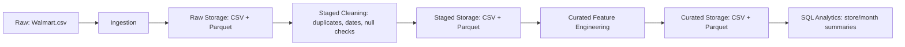

# Data Engineering Pipeline

The retail AI platform implements a Raw -> Staged -> Curated data flow for Walmart weekly sales data.

## Pipeline Flow



## Local Implementation

Run:

```powershell
venv\Scripts\python.exe -B data_pipeline\pipelines\retail_data_pipeline.py
```

Outputs:

- `data_pipeline/storage/raw/walmart_raw.parquet`
- `data_pipeline/storage/staged/walmart_staged.parquet`
- `data_pipeline/storage/curated/walmart_curated.parquet`
- `data_pipeline/storage/curated/store_sales_summary.parquet`
- `data_pipeline/storage/curated/monthly_sales_summary.parquet`

The pipeline also keeps these ML training files updated:

- `ml/datasets/staged/cleaned_walmart.csv`
- `ml/datasets/curated/featured_walmart.csv`

## Azure Implementation

This repository includes Azure-ready artifacts:

- Azure Data Factory pipeline template: `deployment/adf_retail_pipeline_template.json`
- Databricks/Fabric PySpark transformation: `data_pipeline/transformation/retail_pyspark_pipeline.py`

Azure flow:

1. Azure Data Factory ingests raw `Walmart.csv` into the lake raw zone.
2. Azure Databricks or Azure Fabric runs the PySpark transformation.
3. PySpark cleans raw data into staged parquet.
4. PySpark creates curated feature data in parquet.
5. Spark SQL creates store and monthly summary tables.

Expected cloud paths:

- `Files/retail/raw/Walmart.csv`
- `Files/retail/staged/walmart_staged`
- `Files/retail/curated/walmart_curated`
- `Files/retail/curated/store_sales_summary`
- `Files/retail/curated/monthly_sales_summary`

## Deliverables Covered

- Raw -> Staged -> Curated data flow
- Parquet-based storage
- SQL analytics summaries
- Azure Data Factory ingestion template
- Azure Databricks / Azure Fabric PySpark transformation
