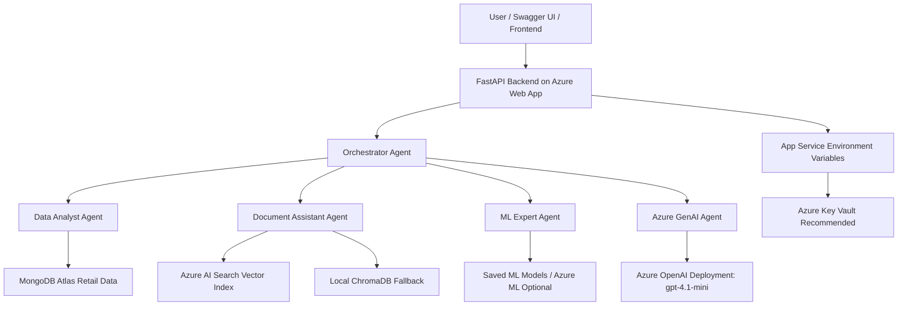

# Azure Deployment Diagram

Azure components used:

- Azure OpenAI through Microsoft Foundry
- Azure AI Foundry for model deployment management
- Azure Web App / App Service for FastAPI deployment
- Azure AI Search for cloud RAG vector retrieval
